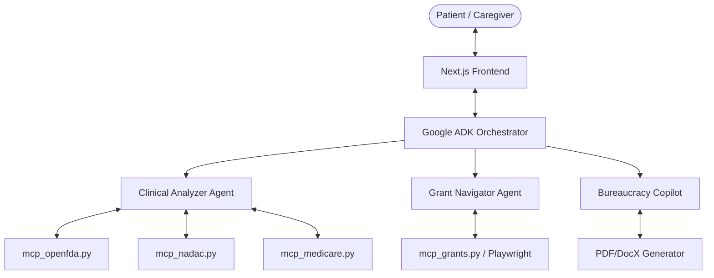

# Financial Toxicity Advocate: Architecture & Business Logic

This document outlines the architecture and business logic flow of our multi-agent AI system designed to combat financial toxicity for oncology patients.

## 1. High-Level Architecture

The system is built on a **Multi-Agent Orchestration** model, separating concerns into specialized AI agents that communicate through a central orchestrator.

### Core Components
1. **Frontend (Next.js):** A clean, accessible web interface where patients input their prescribed drug, dosage, and cancer diagnosis.
2. **Orchestrator (`adk_orchestrator.py`):** The central brain built with the Google Agentic Development Kit (ADK). It manages the conversation, parses the user's regimen, and delegates tasks to the appropriate specialized agents.
3. **Model Context Protocol (MCP) Servers:** Lightweight, standalone Python servers that provide agents with structured access to external APIs and web scrapers.

---

## 2. Specialized Agents

### A. The Clinical Analyzer
**Role:** Validates the medical regimen and establishes a cost baseline.
**Tools Provided:**
*   `mcp_openfda`: Queries the FDA database. Validates that the drug is a human prescription drug and matches the provided diagnosis.
*   `mcp_nadac`: Queries the CMS National Average Drug Acquisition Cost API to find the wholesale cost per pill/ml.
*   `mcp_medicare`: Queries the CMS Medicare Part D Spending API to find real-world national average spending per claim for the drug.

### B. The Grant Navigator
**Role:** Hunts for real-time financial assistance.
**Tools Provided:**
*   `mcp_grants`: Uses Playwright (headless browser) to scrape Javascript-rendered non-profit websites (HealthWell, TotalAssist) and static directories (RxAssist, NeedyMeds) to find whether a specific cancer fund is currently "OPEN" or "CLOSED".

### C. The Bureaucracy Copilot (Planned)
**Role:** Automates the paperwork.
**Tools Provided:**
*   Document generation tools to pre-fill PDF/DocX appeal letters, prior authorization requests, or grant applications based on the findings of the other two agents.

---

## 3. Business Logic Flow

The end-to-end execution follows a strict multi-phase workflow.

### Phase 1: Intake & Validation
1. **User Input:** The patient submits their row data: `[Drug] + [Dosage] + [Diagnosis]`.
2. **Routing:** The Orchestrator receives the data and wakes up the **Clinical Analyzer**.
3. **Clinical Check:** The analyzer calls `openFDA` to ensure the drug is actually prescribed for the given diagnosis (catching user typos or off-label use that insurance might deny).

### Phase 2: Cost Baselining
4. **Acquisition Cost:** The Clinical Analyzer calls `NADAC` to get the baseline unit cost, multiplying it by the user's dosage to determine the "Worst-Case Uninsured Cost".
5. **Real-World Cost:** The analyzer calls `Medicare Part D` to get historical context on what the average claim actually costs nationally.

### Phase 3: The Funding Hunt
6. **Handoff:** The Orchestrator takes the validated data and wakes up the **Grant Navigator**.
7. **Real-Time Scraping:** The navigator triggers the Playwright scrapers. It parses HealthWell and TotalAssist specifically looking for the user's `[Diagnosis]`.
8. **Status Evaluation:** It evaluates the scraped HTML to determine if the specific disease fund is currently `OPEN`, `CLOSED`, or `WAITLISTED`.

### Phase 4: Synthesis & Output
9. **Aggregation:** The Orchestrator compiles the Clinical Analyzer's cost report and the Grant Navigator's funding report.
10. **Delivery:** The Frontend displays a comprehensive dashboard:
    *   *Here is what your drug costs (NADAC/Medicare).*
    *   *Here are the non-profits that currently have open funds for your exact cancer.*
    *   *Here are the direct links to apply.*
11. **Paperwork (Future):** The user can click "Generate Appeal", waking up the **Bureaucracy Copilot** to draft the necessary documents.
